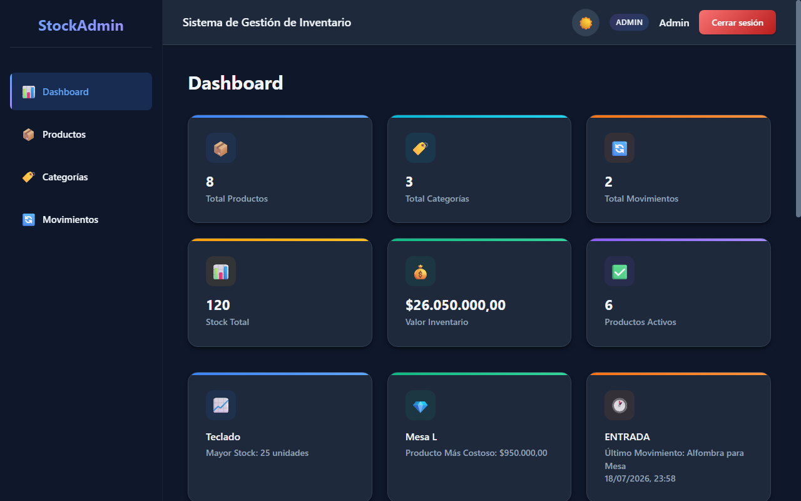
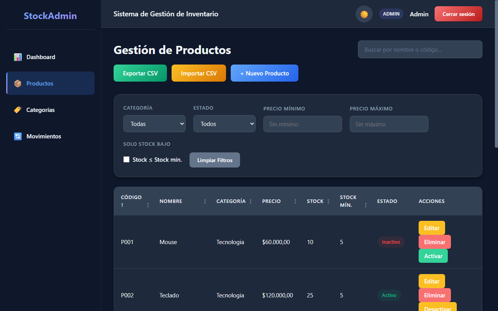
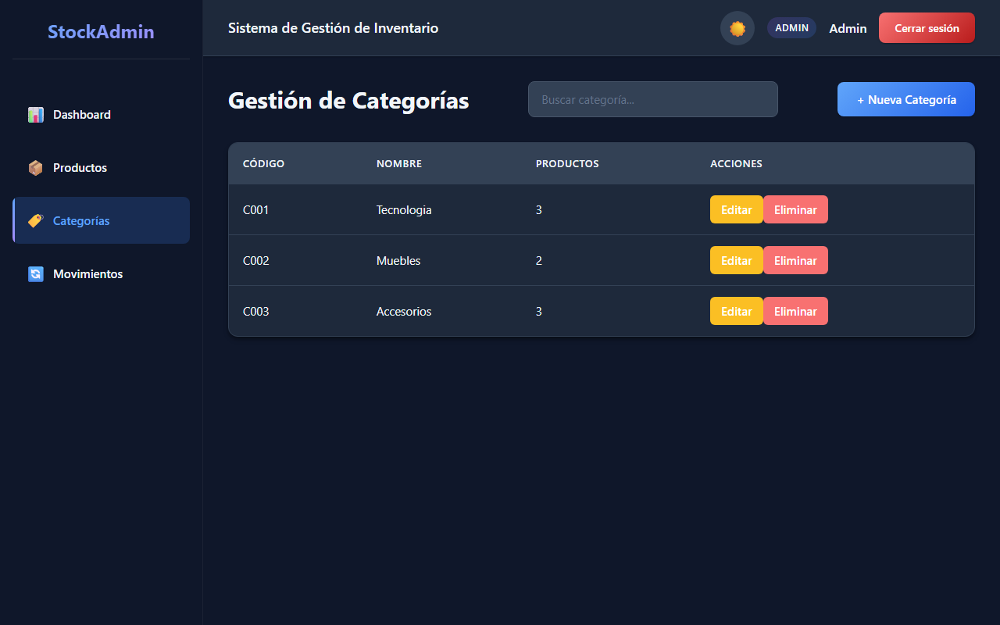
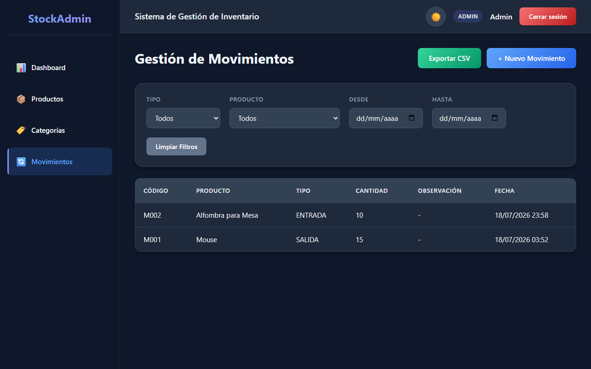
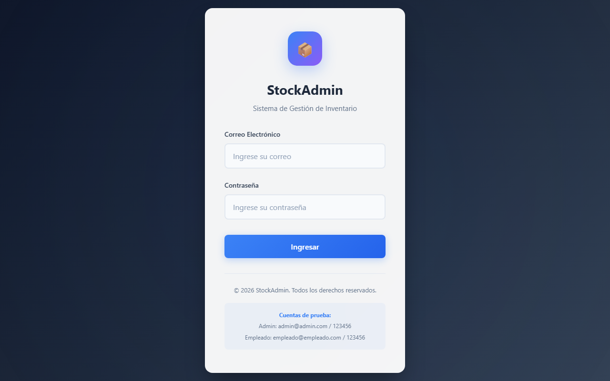

# StockAdmin

Sistema de gestión de inventario web construido con Angular 21 y PostgreSQL. Aplicación SPA con SSR, autenticación por roles y operaciones CRUD completas.

## Capturas







## Cuentas de Prueba

| Rol | Email | Contraseña |
|-----|-------|------------|
| Admin | admin@admin.com | 123456 |
| Empleado | empleado@empleado.com | 123456 |

## Tecnologías

- **Frontend:** Angular 21, TypeScript 5.9, HTML5, CSS3
- **Backend:** Node.js + Express 5 (integrado en Angular SSR)
- **Base de Datos:** PostgreSQL 12+
- **Paquetes clave:** pg (node-postgres), dotenv, zone.js

## Características

### Módulos

- **Login** — Autenticación con roles (admin/empleado), guard de rutas protegidas, mensajes distintos para credenciales incorrectas y errores de conexión
- **Dashboard** — Estadísticas generales, productos recientes, stock bajo, últimos movimientos
- **Productos** — CRUD completo, código automático, búsqueda, paginación, activar/desactivar, exportar a CSV y importar desde CSV
- **Categorías** — CRUD completo, código automático, protección al eliminar con productos asociados
- **Movimientos** — Registro de entradas/salidas, actualización automática de stock, filtros por fecha/tipo/producto, exportar historial a CSV

### UI/UX

- Layout con sidebar colapsable y navbar
- Modo oscuro con toggle y persistencia en localStorage
- Diseño responsive (móvil)
- Spinner de carga global al navegar entre vistas
- Toasts de notificación
- Modales para crear/editar/eliminar
- Página 404
- Login con efecto glassmorphism

### Permisos por Rol

| Funcionalidad | Admin | Empleado |
|---------------|-------|----------|
| Dashboard | Solo lectura | Solo lectura |
| Productos | Crear, Editar, Eliminar, Activar/Desactivar | Solo lectura |
| Categorías | Crear, Editar, Eliminar | Solo lectura |
| Movimientos | Crear, Filtros | Crear, Filtros |

> Nota: el rol se aplica actualmente en la interfaz (botones ocultos). La API no verifica el rol por sí sola.

### Backend API REST

| Método | Ruta | Descripción |
|--------|------|-------------|
| POST | /api/auth/login | Iniciar sesión |
| GET | /api/products | Listar productos |
| POST | /api/products | Crear producto |
| POST | /api/products/import | Importar productos desde CSV |
| PUT | /api/products/:code | Actualizar producto |
| DELETE | /api/products/:code | Eliminar producto |
| PATCH | /api/products/:code/toggle-status | Cambiar estado (Activo/Inactivo) |
| GET | /api/categories | Listar categorías |
| GET | /api/categories/:code | Obtener categoría por código |
| POST | /api/categories | Crear categoría |
| PUT | /api/categories/:code | Actualizar categoría |
| DELETE | /api/categories/:code | Eliminar categoría |
| GET | /api/movements | Listar movimientos |
| POST | /api/movements | Crear movimiento (actualiza stock) |
| GET | /api/movements/generate-code | Generar código de movimiento |

## Estructura del Proyecto

```
src/
├── app/
│   ├── dashboard/          # Dashboard con estadísticas
│   ├── products/           # Módulo de productos
│   ├── categories/         # Módulo de categorías
│   ├── movements/          # Módulo de movimientos
│   ├── login/              # Login
│   ├── layout/             # Layout con sidebar y navbar
│   ├── not-found/          # Página 404
│   ├── shared/
│   │   ├── spinner/        # Componente de carga global
│   │   ├── toast/          # Notificaciones toast
│   │   ├── error-handler/  # Manejador de errores global
│   │   ├── csv.ts          # Utilidades de CSV (parseo, exportación, delimitadores)
│   │   └── styles.css      # Estilos globales y variables CSS
│   ├── guards/             # Auth guard
│   ├── services/           # Servicios HTTP (auth, product, category, movement)
│   ├── models/             # Interfaces TypeScript (product, category, movement)
│   ├── app.config.ts       # Configuración de la app
│   ├── app.routes.ts       # Rutas del cliente
│   └── app.routes.server.ts # Rutas del servidor (SSR)
├── server/
│   ├── routes/             # Rutas API Express
│   ├── db.ts               # Pool de conexiones PostgreSQL
│   └── schema.sql          # Esquema de la base de datos
├── docs/
│   └── screenshots/        # Capturas de pantalla del README
└── server.ts               # Entry point del servidor
```

## Base de Datos

### Diagrama de Relaciones

```
users (1) ──────< movements (N)
                    │
categories (1) ───< products (N) >──── movements (N)
```

### Tablas

- **users** — id, nombre, email, password, role (admin/empleado)
- **categories** — id, code, name
- **products** — id, code, name, description, price, stock, min_stock, category_id, status
- **movements** — id, code, product_id, type (ENTRADA/SALIDA), quantity, observation, user_id

## Requisitos

- Node.js 18+
- PostgreSQL 12+ (agregado al PATH)
- npm 11+

## Instalación

```bash
# Clonar el repositorio
git clone https://github.com/JohanHawkins/StockAdmin.git
cd StockAdmin

# Instalar dependencias
npm install
```

### Base de Datos

```bash
# Crear la base de datos
psql -U postgres -c "CREATE DATABASE stockadmin;"

# Ejecutar el esquema
psql -U postgres -d stockadmin -f src/server/schema.sql
```

### Variables de Entorno

```bash
# Copiar el archivo de ejemplo
cp .env.example .env
```

Editar `.env` con los valores de tu base de datos:

```
DB_HOST=localhost
DB_PORT=5432
DB_NAME=stockadmin
DB_USER=postgres
DB_PASSWORD=postgres
```

### Ejecución

```bash
# Compilar el proyecto
npm run build

# Arrancar el servidor (puerto 4000)
npm run serve:ssr:StockAdmin
```

Abrir http://localhost:4000

## Pruebas

```bash
# Ejecutar los tests (Vitest)
npm test
```

## Licencia

Este es un proyecto privado.
